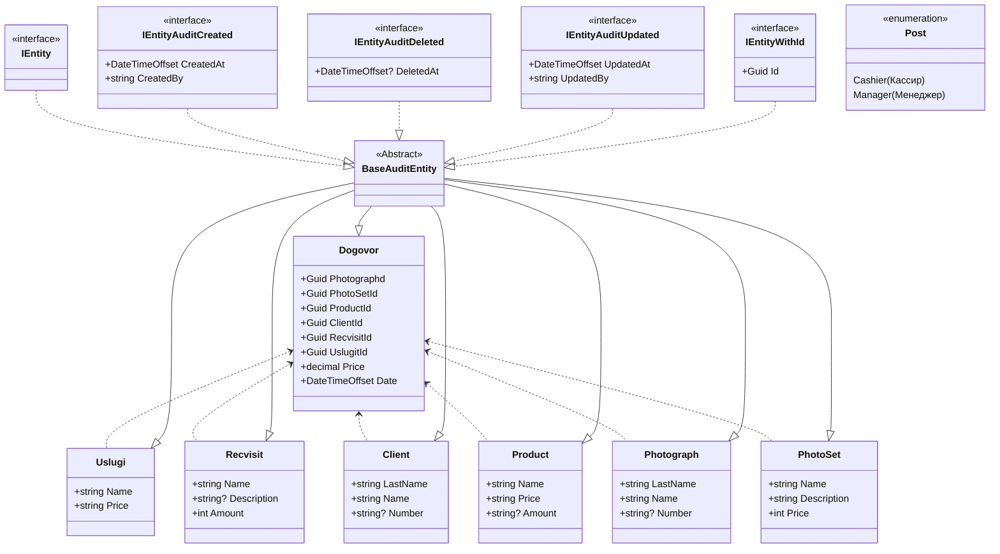

Описание предметной области
---
Автоматизация создания договоров для фотостудии.

Автор
---
Бажин Кирилл Андреевич студент группы ИП 20-3Схема моделей
---

use PhotoStudiyDbAPI


SQL скрипт
```

INSERT INTO [dbo].[Clients] 
           ([Id] 
           ,[Number] 
           ,[Name] 
           ,[LastName] 
           ,[CreatedAt] 
           ,[CreatedBy] 
           ,[DeletedAt] 
           ,[UpdatedAt] 
           ,[UpdatedBy]) 
     VALUES 
           ('edf6b122-3fc3-4793-978b-3fd42f840c45' 
           ,'123456789' 
           ,N'Кочетков' 
           ,N'Денис' 
           ,GETDATE() 
           ,'Insert' 
           ,null 
           ,GETDATE() 
           ,'Insert') 

INSERT INTO [dbo].[Clients] 
           ([Id] 
           ,[Number] 
           ,[Name] 
           ,[LastName] 
           ,[CreatedAt] 
           ,[CreatedBy] 
           ,[DeletedAt] 
           ,[UpdatedAt] 
           ,[UpdatedBy]) 
     VALUES 
           ('ed22b122-3fc3-4793-978b-3fd42f840c45' 
           ,'123456722' 
           ,N'Коршикова' 
           ,N'Эльвина' 
           ,GETDATE() 
           ,'Insert' 
           ,null 
           ,GETDATE() 
           ,'Insert') 
INSERT INTO [dbo].[Photograghs] 
           ([Id] 
           ,[Number] 
           ,[Name] 
           ,[LastName] 
           ,[CreatedAt] 
           ,[CreatedBy] 
           ,[DeletedAt] 
           ,[UpdatedAt] 
           ,[UpdatedBy]) 
     VALUES 
           ('ed22b122-3f34-4793-978b-3fd42f840c45' 
           ,'123444333' 
           ,N'Малышева' 
           ,N'Никита' 
           ,GETDATE() 
           ,'Insert' 
           ,null 
           ,GETDATE() 
           ,'Insert') 
		   INSERT INTO [dbo].[Photograghs] 
           ([Id] 
           ,[Number] 
           ,[Name] 
           ,[LastName] 
           ,[CreatedAt] 
           ,[CreatedBy] 
           ,[DeletedAt] 
           ,[UpdatedAt] 
           ,[UpdatedBy]) 
     VALUES 
           ('ed22b122-3f34-4722-978b-3fd42f840c45' 
           ,'123111333' 
           ,N'Малышева' 
           ,N'Александра' 
           ,GETDATE() 
           ,'Insert' 
           ,null 
           ,GETDATE() 
           ,'Insert') 
INSERT INTO [dbo].[PhotoSets] 
           ([Id] 
           ,[Name]
           ,[Description]
           ,[Price]
           ,[CreatedAt]
           ,[CreatedBy]
           ,[DeletedAt]
           ,[UpdatedAt]
           ,[UpdatedBy])
     VALUES
           ('80f6b724-c314-449f-8569-437837fae723'
           ,N'Елки'
           ,N'Фотосессия на елке' 
           ,N'3000' 
           ,GETDATE()
           ,'Insert'
           ,null
           ,GETDATE()
           ,'Insert')

INSERT INTO [dbo].[Products]
           ([Id]
           ,[Name]
           ,[Price]
		   ,[Amount]
           ,[CreatedAt]
           ,[CreatedBy]
           ,[DeletedAt]
           ,[UpdatedAt]
           ,[UpdatedBy])
     VALUES
           ('4ebf7677-ea7c-404e-a633-1795e795feaf'
             ,N'Кружка'
           ,N'100' 
           ,35
           ,GETDATE()
           ,'Insert'
           ,null
           ,GETDATE()
           ,'Insert')

INSERT INTO [dbo].[Recvisits]
           ([Id]
           ,[Name]
		   ,[Description]
           ,[Amount]
           ,[CreatedAt]
           ,[CreatedBy]
           ,[DeletedAt]
           ,[UpdatedAt]
           ,[UpdatedBy])
      VALUES
           ('4ebf7677-ea7c-404e-a633-1795e7922222'
             ,N'ШляпаКовбоя'
           ,N'Шляпа ковбойская' 
           ,2
           ,GETDATE()
           ,'Insert'
           ,null
           ,GETDATE()
           ,'Insert')

INSERT INTO [dbo].[Uslugs]
           ([Id]
           ,[Name]
           ,[Price]
           ,[CreatedAt]
           ,[CreatedBy]
           ,[DeletedAt]
           ,[UpdatedAt]
           ,[UpdatedBy])
     VALUES
           ('4ebf7677-ea7c-404e-a633-1795e7922222'
             ,N'Фото колаж'
           ,N'700' 
           ,GETDATE()
           ,'Insert'
           ,null
           ,GETDATE()
           ,'Insert')


           ,'Insert')

INSERT INTO [dbo].[Dogovors]
           ([Id]
           ,[PhotographId]
           ,[PhotosetId]
		   ,[ProductId]
           ,[RecvisitId]
           ,[ClientId]
           ,[UslugiId]	
           ,[Price]
           ,[Date]
           ,[CreatedAt]
           ,[CreatedBy]
           ,[DeletedAt]
           ,[UpdatedAt]
           ,[UpdatedBy])
     VALUES
           ('ed22b122-3f34-4793-978b-3fd42f840346'
		   ,'788d2752-0e96-41f9-94b8-21532b9309bf'
           ,'b82fdf2e-5448-4aeb-84eb-302978f2b1cc'
           ,'1e3865dc-8277-4c85-ba22-e3cc90752bac'
		   ,'44b298b6-6036-4b91-8a4c-21f5132506fa'
           ,'06146f81-1945-4c97-8217-2f9bbeb80976'
           ,'28ce45ff-86ff-4bc1-b9f6-cb0bbc428f91'
           ,N'150000' 
           ,GETDATE()
           ,GETDATE()
           ,'Insert'
           ,null
           ,GETDATE()
           ,'Insert')
```
